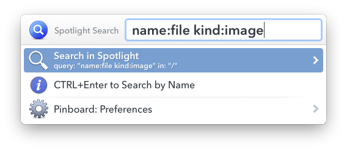
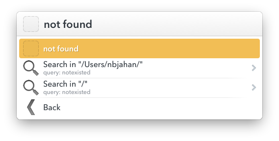
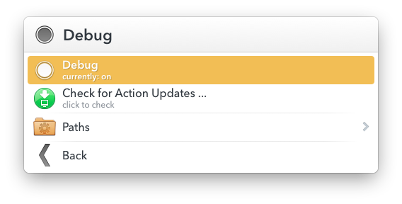

# Spotlight Search for LaunchBar

Search in Spotlight with [LaunchBar 6](http://obdev.at/products/launchbar) and show the results as a list.

## Download

Download the latest version from: https://github.com/nbjahan/launchbar-spotlight/releases/latest

## Changelog

#### v2.1.0
- `new` Ability to change the search path by typing the folder path (also fixes #1)

#### v2.0.2
- `fixed` an updating issue
- `fixed` a typo thanks @jonohunt :p

#### v2.0.1
- `new` Single action (Hold ^ to search by name)
- `new` Send folders to change the search path
- `new` Suggest search in parent folders if not found
- `new` Check for updates , ...
- `fixed` update link

## Usage

### Spotlight Search by Name

Just hold CTRL (⌃) to search by name. or you can always pass `mdfind` arguments (`name:`, ...) __*`new in v2`*__

### Spotlight Search

Search in Spotlight and displays the results. You can enter advanced queries:

    -onlyin ~ "kMDItemUserTags=='*' && kMDItemContentType=='*app*"

To change the search path send a folder or type a valid folder path as first argument you can always override the search path with `-onlyin` argument. __*`new in v2`*__

When it finds nothing you can select to search parent directories __*`new in v2`*__

If you know the type of item you’re looking for, you can specify it when performing a search. To specify the type, add the text `kind:<type of item>` at the end of your search. For example, if you want to search for images of New York City, enter `New York City kind:images.` If you want to search for email messages that mention Anne Johnson, enter `Anne Johnson kind:email.`

Kind            | `<type of item>`
----------------|---------------
Apps            | applicationapplications,app
Contacts        | contact,contacts
Folders         | folder,folders
Email           | email,emails,mail message,mail messages
Calendar events | event,events
Reminders       | reminder,reminders
Images          | image,images
Movies          | movie,movies
Music           | music
Audio           | audio
PDF             | pdf,pdfs
Preferences     | system preferences,preferences
Bookmarks       | bookmark,bookmarks
Fonts           | font,fonts
Presentations   | presentation,presentations

### Preferences

Debug, Update, ...

## Requirements

Make sure spotlight is enabled on your system eaither by using finder spotlight search or this command: `sudo mdutil -a -s`

## Help with advance spotlight queries

 * [Narrow down Spotlight search results](http://support.apple.com/kb/PH14172)
 * [Keywords to use in Spotlight searches](http://support.apple.com/kb/PH14214)
 * [File Metadata Query Expression Syntax](http://bit.ly/spotlightqueries)
 * [SS64 | Command line reference | mdfind](http://ss64.com/osx/mdfind.html)
 